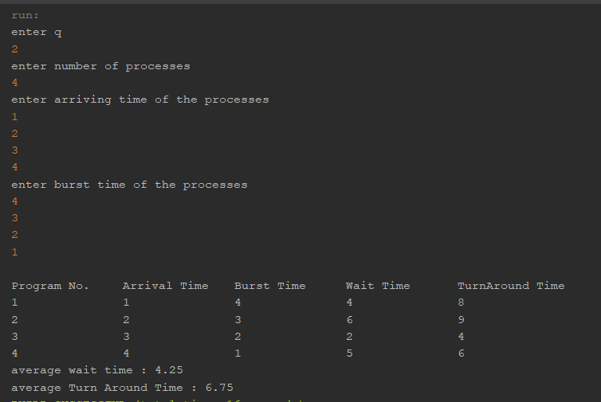
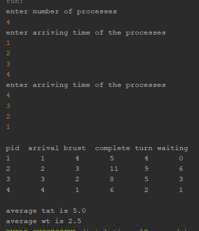

# CPU Scheduling Algorithms RR & SJF implementation in java

This project contains Java implementations of two CPU scheduling algorithms: Round Robin (RR) and Shortest Job First (SJF).

## Round Robin (RR) Scheduling

output:

##Shortest Job First (SJF) Scheduling

output:

